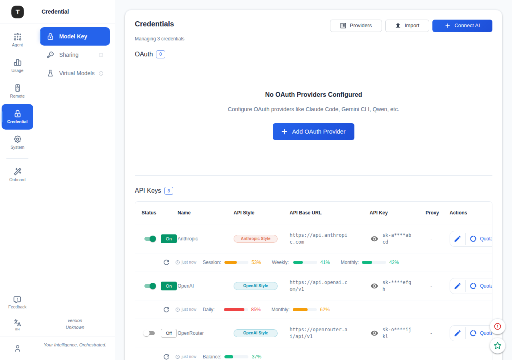
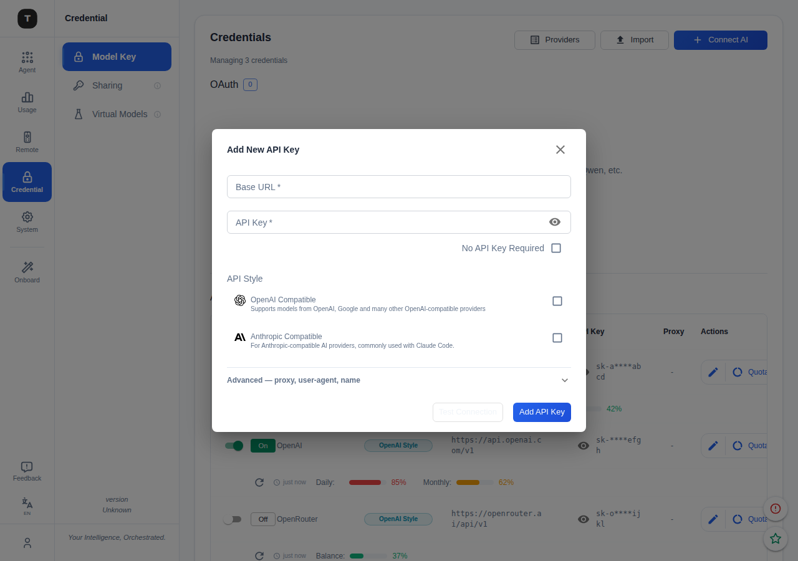
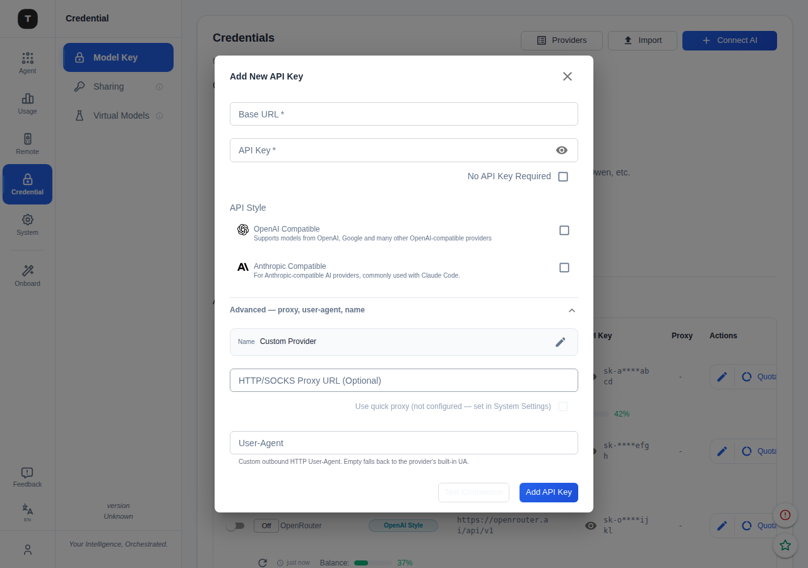

# Connect AI Flow

Unified two-step flow for adding any AI credential — API key, OAuth sign-in, or
self-hosted inference server — replacing the old separate "Add OAuth" + "Add API Key"
buttons with a single entry point.

## Entry point

Button label: **Connect AI** (previously "Connect Provider").  
Lives in the Credential → Model Key page header.



---

## Step 1 — Picker ("Connect AI" dialog)

A scrollable picker grouped into four sections.  
Title, description, and search bar are **locked** (don't scroll with the card list).  
Scrollbar is always visible on the card area.


**Section order:** Custom → OAuth sign-in → Self-hosted → API key providers

| Section | Grid | Badge | Notes |
|---|---|---|---|
| Custom | responsive 1/2/3-column in dialog | Key | "Custom endpoint" (free-form URL), "Import" |
| OAuth sign-in | responsive 1/2/3-column in dialog | OAuth (green) | Choosing a card opens OAuth direct mode |
| Self-hosted | responsive 1/2/3-column in dialog | Self-hosted (amber) | Ollama, LM Studio, LocalAI, Jan, vLLM, SGLang |
| API key providers | responsive 1/2/3-column in dialog | Key / region | Provider templates pre-fill protocol slots |

**Custom** — the custom card opens the same protocol-slot form as presets, but with empty URLs.
Users can enable OpenAI, Anthropic, or both protocol slots in the form; dual-endpoint
configuration is no longer a separate picker card or mode. See [dual-provider.md](dual-provider.md).

**Routing on card click:**
- **Custom / Key provider / Self-hosted** → opens the form dialog (pre-filled when a template was chosen)
- **Import** → opens the import modal
- **OAuth** → opens OAuthDialog in direct mode (skips the provider grid, shows provider + proxy config, then starts auth)

### Flow at a glance

```
                       ┌──────────────────────────────┐
                       │   "Connect AI"  (picker)     │
                       │  search ▸ filter all cards   │
                       └──────────────┬───────────────┘
                                      │ onSelect(ConnectSelection)
        ┌───────────────┬─────────────┼─────────────┬───────────────┬─────────────┐
        │ kind:'custom' │ kind:'import'│ kind:'key' │ kind:'local'  │ kind:'oauth'│
        ▼               ▼              ▼             ▼               ▼
  ┌───────────┐  ┌─────────────┐ ┌──────────┐ ┌────────────┐ ┌──────────────┐
  │ Blank     │  │ ImportModal │ │ preset   │ │ self-hosted│ │ OAuthDialog  │
  │ protocol  │  │ clipboard / │ │ pre-fill │ │ pre-fill   │ │ direct mode  │
  │ slots     │  │ file import │ │ from     │ │ localhost  │ │ provider +   │
  │           │  │             │ │ template │ │ :port +    │ │ proxy config │
  │           │  │             │ │          │ │ key conv.  │ │ ▸ sign in    │
  └─────┬─────┘  └─────────────┘ └────┬─────┘ └─────┬──────┘ └──────┬───────┘
        │                              │             │               │
        └──────────────────────────────┴─────────────┘               │
                               ▼                                     ▼
                    ┌─────────────────────┐                ┌──────────────────┐
                    │  ProviderFormDialog  │                │  token stored on │
                    │  (← Back re-opens    │                │  callback; new   │
                    │   the picker)        │                │  provider record │
                    └──────────┬───────────┘                └──────────────────┘
                               │ submit
                               ▼
                    ┌─────────────────────┐
                    │  api.addProvider     │  one record; optional
                    │                     │  api_base_openai + api_base_anthropic
                    └─────────────────────┘
```

Three surfaces render this picker → form sequence and each should wire the same
`ConnectSelection` kinds: `CredentialPage.tsx` (full credential management),
`useProviderDialog.tsx` (shared add-flow hook), and `ConnectProviderFlow.tsx`
(the scenario "Use …" pages).

---

## Step 2 — API key form

Layout top → bottom:

1. **Protocols** — independent OpenAI / Anthropic URL slots; at least one enabled URL is required
2. **API Key** — password field with show/hide toggle
3. **No API Key Required** — checkbox tied to the key field; self-hosted templates may keep the key optional but editable
4. **Proxy URL** — optional; can use the global quick proxy
5. **Advanced accordion** — collapsed by default in add mode, auto-expanded in edit mode; contains provider name and custom User-Agent

When opened from the picker, the form shows a **← Back** button (bottom-left) that
closes the form and re-opens the picker. "Test Connection" and the submit button stay
grouped on the bottom-right.





The dialog is capped at `88vh`. The content area scrolls independently; action buttons are always pinned at the bottom.

### Self-hosted provider pre-fill

Self-hosted cards pre-fill the form based on ecosystem conventions:

| Provider | Default URL | Pre-filled API Key | Notes |
|---|---|---|---|
| Ollama | `http://localhost:11434/v1` | `ollama` | Server ignores auth by default; clients pass this as placeholder |
| LM Studio | `http://localhost:1234/v1` | `lm-studio` | LiteLLM / aider convention |
| LocalAI | `http://localhost:8080/v1` | _(empty)_ | No convention; marked Optional |
| Jan | `http://localhost:1337/v1` | _(empty)_ | No convention; marked Optional |
| vLLM | `http://localhost:8000/v1` | `EMPTY` | Official docs placeholder |
| SGLang | `http://localhost:30000/v1` | `EMPTY` | Official docs placeholder |

All six ship with auth **disabled** by default. Pre-filled keys are client-side
conventions only — the server accepts them (or nothing) when auth is off. Users
running a server with real auth configured can overwrite the field.

The `optionalEditable` prop on `ApiKeyField` keeps the field editable even when
`noKeyRequired` is true (LocalAI / Jan), so users who do configure auth can still
enter their key without unchecking a separate toggle.

---

## Design decisions

| Decision | Rationale |
|---|---|
| "Connect AI" not "Connect Provider" | Friendlier; covers OAuth, API key, and self-hosted under one verb |
| Self-hosted as separate section, not mixed into API key providers | Different auth model (optional/placeholder key, URL is the main config); amber accent distinguishes it visually |
| Static list, no auto-detection | Auto-probing localhost ports adds latency and complexity; users know what they're running |
| Pre-fill default API key per provider | Reduces friction: users with default setup click through without typing; users with real auth just overwrite |
| ← Back button when opened from picker | Users can reconsider provider choice without dismissing the whole flow |
| Back + [Test | Submit] layout via `ml:auto` | Avoids `justifyContent: space-between` + empty placeholder span |
| Header locked in picker | Description + search don't scroll away when the list is long |
| Responsive 1/2/3-column picker grid | Uses one column on mobile, two on small screens, and three on large dialogs to reduce scrolling without adding another mode |
| "No API Key Required" tied to key field | Checkbox placement matches the key field it modifies; self-hosted optional-key cases still leave the token editable |
| Advanced accordion | Proxy, user-agent, name are rarely needed; hiding them shortens the common add-key path |
| Base URL required validation | Blocks submit and shows an inline field error; clears on first keystroke |
| Empty `!` fix in test panel | Splitting an empty `details` string produced a dangling warning icon with no text |
| OAuth direct mode | Picker already chose the provider; OAuthDialog skips its own grid via `autoStartProviderId`, shows provider/proxy configuration, and supports retrying a failed authorization initialization |

---

## Key files

| File | Role |
|---|---|
| `frontend/src/components/ConnectProviderDialog.tsx` | Step 1 — unified picker and provider grouping/search |
| `frontend/src/components/ProviderFormDialog.tsx` | Step 2 — API key / custom / protocol-slot form; `onBack` prop for picker navigation |
| `frontend/src/components/OAuthDialog.tsx` | Step 2 — OAuth flow; `autoStartProviderId` for direct mode |
| `frontend/src/pages/CredentialPage.tsx` | Credential-management surface; standard add flow uses `useProviderDialog`, edit flow uses `useProviderEditDialog` |
| `frontend/src/hooks/useProviderDialog.tsx` | Shared picker → form routing for the standard add flow; owns optional self-hosted token behavior and add-provider payload |
| `frontend/src/components/ConnectProviderFlow.tsx` | Scenario "Use …" pages: local picker → form/OAuth routing |
| `frontend/src/components/provider-form-dialog/ApiKeyField.tsx` | Key field; optional editable token state for self-hosted providers |
| `frontend/src/components/provider-form-dialog/ProtocolSlot.tsx` | OpenAI / Anthropic URL slot UI |
| `frontend/src/components/provider-form-dialog/ProxyUrlField.tsx` | Proxy URL and global quick-proxy selector |
| `frontend/src/components/provider-form-dialog/KeyNameField.tsx` | Advanced provider-name field |
| `frontend/src/components/provider-form-dialog/VerificationResultPanel.tsx` | Test result panel; filters empty detail rows |
| `frontend/src/components/provider-form-dialog/probe.ts` | Lightweight probe adapter for "Test Connection" |
| `internal/data/providers.json` | Provider templates; self-hosted entries use `region: "self-hosted"` |
